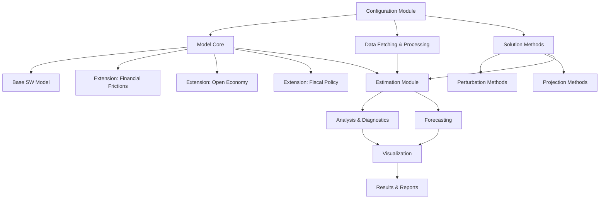
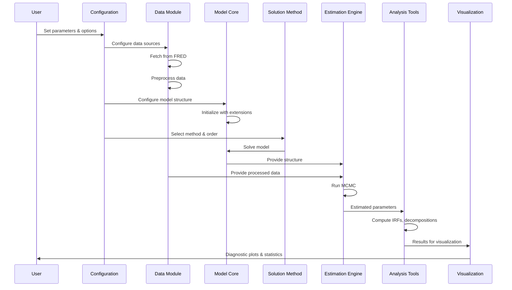
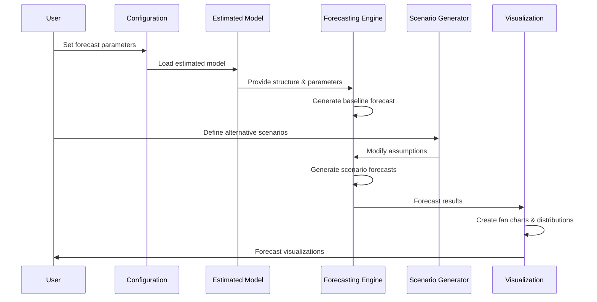
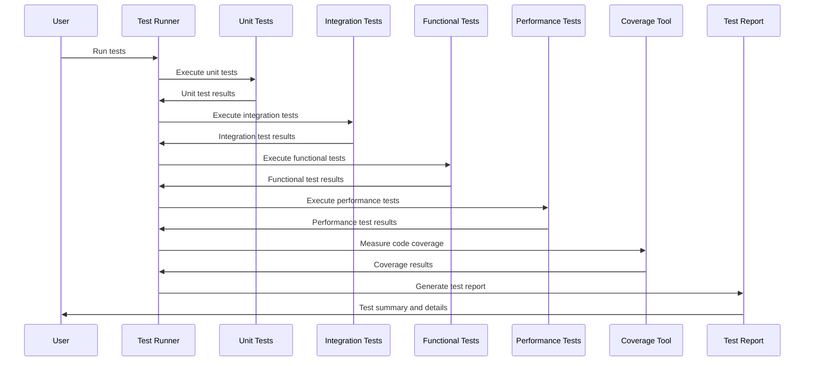

# Smets and Wouters DSGE Model Implementation

A comprehensive Python implementation of the Smets and Wouters (2007) DSGE model with modern extensions, featuring modular design, multiple solution methods, and advanced estimation capabilities.

## Project Architecture Overview

The project follows a modular design pattern with clear separation of concerns and extensive configuration options:



## Installation and Setup

### Prerequisites

- **Python**: 3.8 or higher
- **Operating System**: Windows, macOS, or Linux
- **RAM**: Minimum 4GB (8GB+ recommended for larger models)
- **Disk Space**: At least 500MB for installation and example data

### Installation Options

#### Option 1: Installation via pip (Recommended)

```bash
# Create and activate a virtual environment (recommended)
python -m venv dsge-env
# On Windows
dsge-env\Scripts\activate
# On macOS/Linux
source dsge-env/bin/activate

# Install the package
pip install git+https://github.com/username/macroeconomic-sim.git
```

#### Option 2: Manual Installation from Source

```bash
# Clone the repository
git clone https://github.com/username/macroeconomic-sim.git
cd macroeconomic-sim

# Create and activate a virtual environment (recommended)
python -m venv venv
# On Windows
venv\Scripts\activate
# On macOS/Linux
source venv/bin/activate

# Install dependencies
pip install -e .

# Install development dependencies (optional)
pip install -e ".[dev]"

# Install JAX for GPU acceleration (optional)
pip install -e ".[jax]"
```

### Environment Configuration

The DSGE model implementation uses two configuration files:

1. **Estimation Configuration**: `config/estimation_config.json`
2. **Forecast Configuration**: `config/forecast_config.json`

You can customize these files or create your own configuration files to modify model parameters, enable/disable extensions, and configure solution methods.

### Dependencies Management

The package dependencies are managed through `setup.py`. Core dependencies include:
- `numpy` and `scipy` for numerical computing
- `pandas` and `pandas_datareader` for data management
- `matplotlib` and `seaborn` for visualization
- `pymc` for Bayesian estimation
- `sympy` for symbolic manipulation

Optional dependencies:
- `numba` for JIT compilation of performance-critical routines
- `jax` and `jaxlib` for automatic differentiation and GPU acceleration

### Verification

To verify that the installation is working correctly:

```bash
# Run a simple example
python examples/simple_example.py

# Verify the output
ls results/example/
# Should show impulse_responses.png
```

You should see a new directory `results/example/` with impulse response visualizations.

## Project Structure

```
macroeconomic-sim/
├── config/                  # Configuration files
├── data/                    # Data storage
│   ├── raw/                 # Raw data from FRED
│   └── processed/           # Processed data
├── docs/                    # Documentation
├── dsge/                    # Main package
│   ├── core/                # Core model components
│   │   ├── base_model.py    # Base Smets-Wouters model
│   │   └── steady_state.py  # Steady state solver
│   ├── extensions/          # Optional model extensions
│   │   ├── financial.py     # Financial frictions module
│   │   ├── open_economy.py  # Open economy features
│   │   └── fiscal.py        # Fiscal policy extensions
│   ├── data/                # Data handling
│   │   ├── fetcher.py       # FRED data acquisition
│   │   └── processor.py     # Data transformation
│   ├── solution/            # Solution methods
│   │   ├── perturbation.py  # 1st, 2nd, 3rd order perturbation
│   │   └── projection.py    # Projection methods
│   ├── estimation/          # Estimation methods
│   │   ├── bayesian.py      # Bayesian MCMC methods
│   │   ├── priors.py        # Prior distributions
│   │   └── posteriors.py    # Posterior analysis
│   ├── analysis/            # Analysis tools
│   │   ├── impulse_response.py  # IRF computation
│   │   ├── decomposition.py     # Shock decomposition
│   │   └── diagnostics.py       # Model diagnostics
│   ├── forecasting/         # Forecasting tools
│   │   ├── baseline.py      # Baseline forecasts
│   │   ├── scenarios.py     # Alternative scenarios
│   │   └── uncertainty.py   # Uncertainty quantification
│   └── visualization/       # Visualization tools
│       ├── plots.py         # Standard plots
│       ├── publication.py   # Publication-quality figures
│       └── interactive.py   # Interactive visualizations
├── tests/                   # Testing framework
│   ├── unit/                # Unit tests
│   ├── integration/         # Integration tests
│   ├── functional/          # Functional tests
│   ├── performance/         # Performance tests
│   ├── debug/               # Debugging scripts
│   ├── utils/               # Test utilities
│   ├── conftest.py          # Test fixtures
│   ├── run_tests.py         # Master test script
│   └── README.md            # Testing documentation
├── examples/                # Example scripts
├── setup.py                 # Package installation
├── run_estimation.py        # Main estimation script
├── run_forecast.py          # Main forecasting script
└── README.md                # Project documentation
```

## Quick Start Guide

### Basic Model Simulation

```python
from config.config_manager import ConfigManager
from dsge.core import SmetsWoutersModel
from dsge.solution import PerturbationSolver

# Create configuration
config = ConfigManager()

# Create model
model = SmetsWoutersModel(config)

# Solve model using first-order perturbation
solver = PerturbationSolver(model, order=1)
solution = solver.solve()

# Simulate model for 40 periods
states, controls = solver.simulate(periods=40)

print("Simulation complete!")
```

### Generating Impulse Responses

```python
from dsge.analysis import ImpulseResponseFunctions
import matplotlib.pyplot as plt

# Create IRF analyzer
irf = ImpulseResponseFunctions(model, config)

# Compute IRFs for technology shock
irfs = irf.compute_irfs(
    shock_names=["technology"],
    periods=40,
    shock_size=1.0
)

# Plot output response to technology shock
plt.figure(figsize=(10, 6))
plt.plot(irfs["technology"]["output"])
plt.title("Output Response to Technology Shock")
plt.xlabel("Periods")
plt.ylabel("Deviation from Steady State")
plt.grid(True)
plt.show()
```

### Running Model Estimation

```bash
# Run estimation with default configuration
python run_estimation.py

# Run estimation with custom configuration
python run_estimation.py --config path/to/custom_config.json
```

### Running Forecasting

```bash
# Run forecasting with default configuration
python run_forecast.py

# Run forecasting with custom configuration
python run_forecast.py --config path/to/custom_config.json
```

### Running Tests

```bash
# Run all tests
python tests/run_tests.py --all

# Run specific test types
python tests/run_tests.py --unit
python tests/run_tests.py --integration
python tests/run_tests.py --functional
python tests/run_tests.py --performance

# Run tests with coverage
python tests/run_tests.py --all --coverage
```

For more detailed examples, please see the `examples/` directory and the comprehensive usage guide in the `docs/` directory.

## Core Components

### Configuration System
The central configuration module will allow users to:
- Toggle model extensions (financial, open economy, fiscal)
- Select solution method (perturbation or projection)
- Choose perturbation order (1st, 2nd, or 3rd)
- Configure model parameters (monetary policy, inflation targets, etc.)
- Set estimation options (priors, MCMC settings)
- Define data sources and preprocessing steps

### Model Implementation

#### Base Smets-Wouters Model
- Complete implementation of all equations from SW (2007)
- Household utility maximization
- Firm production and pricing
- Wage setting
- Monetary policy rule
- Shock processes
- Market clearing conditions

#### Extensions
Each extension will be implemented as a modular component that can be toggled on/off:

**Financial Frictions**
- Based on BGG (1999) and Gertler-Karadi (2011) frameworks
- Financial intermediaries with balance sheet constraints
- Credit spreads and risk premiums
- Financial accelerator mechanisms

**Open Economy Features**
- Based on Adolfson et al. (2007) and Justiniano-Preston (2010)
- Exchange rate dynamics
- International trade
- Uncovered interest parity condition
- Global shock transmission

**Fiscal Policy Extensions**
- Based on recent central bank models (e.g., Leeper, Traum, Walker)
- Detailed government sector
- Various fiscal rules
- Tax distortions
- Government spending multipliers

### Solution Methods

**Perturbation Methods**
- First-order (linear) approximation
- Second-order approximation (capturing some non-linearities)
- Third-order approximation (better accuracy with larger shocks)
- Policy and transition functions

**Projection Methods**
- Collocation with Chebyshev polynomials
- Finite elements method option
- Handling of occasionally binding constraints

### Data Management

**Data Acquisition**
- Automatic fetching from FRED using pandas_datareader
- Support for key macroeconomic series:
  - GDP
  - Inflation
  - Interest rates
  - Consumption
  - Investment
  - Wages
  - Employment/hours worked

**Data Processing**
- Transformation to stationary series
- Detrending options (HP filter, one-sided filters, etc.)
- Seasonal adjustment
- Outlier detection and handling
- Missing value imputation

### Estimation Framework

**Bayesian Estimation**
- MCMC implementation (Metropolis-Hastings algorithm)
- Prior distribution configuration
- Proposal density adaptation
- Convergence diagnostics
- Posterior analysis

**Model Evaluation**
- Marginal likelihood calculation
- Model comparison metrics
- In-sample fit statistics
- Out-of-sample forecast evaluation

### Analysis Tools

**Impulse Response Functions**
- Linear and non-linear IRFs
- Conditional IRFs
- Confidence bands

**Decompositions**
- Historical shock decomposition
- Variance decomposition
- Forecast error variance decomposition

**Diagnostic Tools**
- Parameter identification analysis
- Sensitivity analysis
- Robustness checks

### Forecasting System

**Baseline Forecasting**
- Point forecasts
- Density forecasts
- Conditioning on observables

**Scenario Analysis**
- Alternative policy scenarios
- Stress testing
- Counterfactual analysis

**Uncertainty Visualization**
- Fan charts
- Probability bands
- Density plots

### Visualization

**Publication-Quality Figures**
- LaTeX-compatible outputs
- High-resolution images
- Customizable styles
- Automated figure generation

## Testing Framework

The project includes a comprehensive testing framework to ensure code quality and correctness:

### Test Types

- **Unit Tests**: Test individual components in isolation
- **Integration Tests**: Test interactions between components
- **Functional Tests**: Test end-to-end workflows
- **Performance Tests**: Measure execution time and resource usage

### Test Features

- **Automated Test Discovery**: Tests are automatically discovered and executed
- **Code Coverage**: Measure code coverage to identify untested code
- **Test Reports**: Generate detailed reports of test results
- **Mock Data Generation**: Generate synthetic data for testing
- **Fixtures**: Common test fixtures for reuse across tests
- **Parameterized Tests**: Test multiple inputs with a single test function

### Running Tests

The master test script (`tests/run_tests.py`) provides a unified interface for running tests:

```bash
# Run all tests
python tests/run_tests.py --all

# Run specific test types
python tests/run_tests.py --unit
python tests/run_tests.py --integration
python tests/run_tests.py --functional
python tests/run_tests.py --performance

# Run tests with coverage
python tests/run_tests.py --all --coverage

# Generate a test report
python tests/run_tests.py --all --report test_report.json
```

For more information about the testing framework, see the [tests/README.md](tests/README.md) file.

## Implementation Strategy

### Phase 1: Core Infrastructure
1. Set up project structure and basic package organization
2. Implement configuration system
3. Create data fetching and processing modules
4. Develop base model equations and steady state solver

### Phase 2: Solution Methods
1. Implement perturbation methods (1st, 2nd, 3rd order)
2. Develop projection methods
3. Create testing framework for solution accuracy

### Phase 3: Extensions
1. Implement financial frictions module
2. Develop open economy extensions
3. Create fiscal policy enhancements
4. Ensure proper integration with base model

### Phase 4: Estimation and Analysis
1. Implement Bayesian estimation framework
2. Develop analysis tools (IRFs, decompositions)
3. Create model diagnostics
4. Build forecasting capabilities

### Phase 5: Visualization and Documentation
1. Implement visualization library
2. Create comprehensive documentation
3. Develop example scripts
4. Write unit tests

## Technology Stack

### Core Dependencies
- **numpy, scipy**: Numerical computing
- **pandas, pandas_datareader**: Data management and FRED access
- **matplotlib, seaborn**: Visualization
- **PyMC**: Bayesian estimation (minimal external dependencies)
- **sympy**: Symbolic manipulation for model equations

### Optional Performance Enhancements
- **numba**: JIT compilation for performance-critical routines
- **jax**: Automatic differentiation and GPU acceleration (advanced users)

### Testing Dependencies
- **pytest**: Test framework
- **coverage**: Code coverage measurement
- **pytest-benchmark**: Performance testing

## Workflow Diagrams

### Estimation Workflow



### Forecasting Workflow



### Testing Workflow



## Best Practices

The implementation follows Python best practices:
- Type hints throughout the codebase
- Comprehensive docstrings following NumPy/Google style
- Exception handling with custom exceptions
- Unit tests for all components
- Integration tests for workflows
- Documentation generation from docstrings

## Support and Contribution

For bug reports, feature requests, and contributions, please open an issue or pull request on the GitHub repository.

## License

This project is licensed under the MIT License - see the LICENSE file for details.

## Citation

If you use this implementation in your research, please cite:

```
@software{smets_wouters_dsge,
  author = {Research Team},
  title = {Smets and Wouters DSGE Model Implementation},
  year = {2025},
  url = {https://github.com/username/macroeconomic-sim}
}
```

And the original Smets and Wouters (2007) paper:

```
@article{smets2007shocks,
  title={Shocks and frictions in US business cycles: A Bayesian DSGE approach},
  author={Smets, Frank and Wouters, Rafael},
  journal={American economic review},
  volume={97},
  number={3},
  pages={586--606},
  year={2007}
}