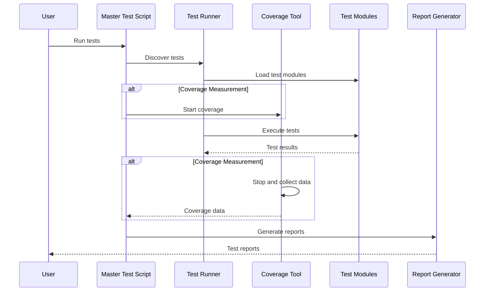
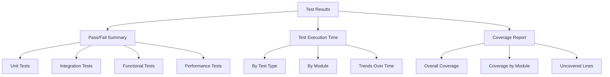

# Comprehensive Testing Framework and Project Refactoring Plan

## Table of Contents

1. [Executive Summary](#executive-summary)
2. [Project Structure Refactoring](#project-structure-refactoring)
   - [Directory Structure](#directory-structure)
   - [Debugging Scripts Relocation](#debugging-scripts-relocation)
3. [Testing Framework Overview](#testing-framework-overview)
   - [Testing Layers](#testing-layers)
   - [Test Execution Flow](#test-execution-flow)
4. [Master Test Script Implementation](#master-test-script-implementation)
   - [Features and Components](#features-and-components)
   - [Script Structure](#script-structure)
   - [Command-Line Arguments](#command-line-arguments)
5. [Unit Testing Guide](#unit-testing-guide)
   - [Principles and Structure](#principles-and-structure)
   - [Test Implementation](#test-implementation)
   - [Test Categories](#test-categories)
6. [Mock Data Implementation](#mock-data-implementation)
   - [Data Types and Generators](#data-types-and-generators)
   - [Usage in Tests](#usage-in-tests)
7. [Implementation Roadmap](#implementation-roadmap)
   - [Phase-by-Phase Plan](#phase-by-phase-plan)
   - [Detailed Schedule](#detailed-schedule)
8. [Appendices](#appendices)
   - [Dependencies](#dependencies)
   - [Best Practices](#best-practices)

---

## Executive Summary

This document provides a comprehensive plan for refactoring the project structure and implementing a robust testing framework for the DSGE model implementation. The plan includes both structural changes to improve organization and a multi-layered testing approach to ensure code quality and correctness.

### Goals and Objectives

The testing framework aims to achieve the following goals:

1. **Improved Project Organization**: Refactor the project structure for better organization and maintainability
2. **Comprehensive Test Coverage**: Create a multi-layered testing approach
3. **Automated Testing**: Implement a master test script for test discovery and execution
4. **Quality Assurance**: Ensure code correctness and prevent regressions

### Key Components

The testing framework consists of the following key components:

1. **Test Utilities**: Mock data generators and test helpers
2. **Master Test Script**: Central script for test discovery, execution, and reporting
3. **Multi-Layered Tests**: Unit, integration, functional, and performance tests
4. **Documentation**: Comprehensive guidelines and examples

### Benefits

This testing framework provides several key benefits:

1. **Confidence**: Comprehensive testing ensures code correctness
2. **Maintainability**: Well-organized project structure improves maintainability
3. **Quality**: Automated testing helps maintain high code quality
4. **Agility**: Robust tests enable confident refactoring and feature development
5. **Documentation**: Tests serve as executable documentation of expected behavior

---

## Project Structure Refactoring

### Directory Structure

The project will be refactored to improve organization and maintainability, with a focus on creating a comprehensive testing framework.

#### Current Structure Issues

The current project structure has several issues:

1. Debugging scripts are mixed with main application files in the root directory
2. There is minimal testing infrastructure
3. The organization does not clearly separate different types of tests

#### Proposed New Structure

```
macroeconomic-sim/
├── config/                  # Configuration files
├── data/                    # Data storage
│   ├── raw/                 # Raw data from FRED
│   └── processed/           # Processed data
├── docs/                    # Documentation
├── dsge/                    # Main package
│   ├── core/                # Core model components
│   ├── data/                # Data handling
│   ├── solution/            # Solution methods
│   ├── estimation/          # Estimation methods
│   ├── analysis/            # Analysis tools
│   ├── forecasting/         # Forecasting tools
│   └── visualization/       # Visualization tools
├── tests/                   # Tests directory
│   ├── __init__.py          # Already exists
│   ├── unit/                # Unit tests for individual components
│   │   ├── __init__.py
│   │   ├── core/            # Tests for dsge/core modules
│   │   ├── data/            # Tests for dsge/data modules
│   │   ├── solution/        # Tests for dsge/solution modules
│   │   ├── estimation/      # Tests for dsge/estimation modules
│   │   ├── analysis/        # Tests for dsge/analysis modules
│   │   ├── forecasting/     # Tests for dsge/forecasting modules
│   │   └── visualization/   # Tests for dsge/visualization modules
│   ├── integration/         # Tests for component interactions
│   │   ├── __init__.py
│   │   ├── test_model_solution.py
│   │   ├── test_data_estimation.py
│   │   └── test_estimation_forecasting.py
│   ├── functional/          # End-to-end workflow tests
│   │   ├── __init__.py
│   │   ├── test_estimation_workflow.py
│   │   ├── test_forecasting_workflow.py
│   │   └── test_scenario_analysis.py
│   ├── performance/         # Performance benchmarks
│   │   ├── __init__.py
│   │   ├── test_solution_speed.py
│   │   ├── test_memory_usage.py
│   │   └── test_scalability.py
│   ├── utils/               # Test utilities and helpers
│   │   ├── __init__.py
│   │   ├── mock_data.py
│   │   └── test_helpers.py
│   ├── debug/               # Relocated debugging scripts
│   │   ├── __init__.py
│   │   ├── debug_steady_state.py
│   │   ├── test_import.py
│   │   ├── test_core_import.py
│   │   └── fix_corruption.py
│   ├── conftest.py          # pytest configuration and fixtures
│   └── master_test.py       # Master test script
├── examples/                # Example scripts
├── run_estimation.py        # Main estimation script
├── run_forecast.py          # Main forecasting script
├── setup.py                 # Package installation
└── README.md                # Project documentation
```

### Debugging Scripts Relocation

#### Scripts to Relocate

The following scripts need to be moved from the root directory to `tests/debug/`:

1. `debug_steady_state.py` → `tests/debug/debug_steady_state.py`
2. `test_import.py` → `tests/debug/test_import.py`
3. `test_core_import.py` → `tests/debug/test_core_import.py`
4. `fix_corruption.py` → `tests/debug/fix_corruption.py`

#### Required Modifications

##### 1. debug_steady_state.py

**Original Path:** `debug_steady_state.py`
**New Path:** `tests/debug/debug_steady_state.py`

**Modifications needed:**
- Update the Python path modification from:
  ```python
  # Add the project root to Python path to import modules
  import os
  import sys
  sys.path.insert(0, os.path.abspath('.'))
  ```
  
  to:
  ```python
  # Add the project root to Python path to import modules
  import os
  import sys
  sys.path.insert(0, os.path.abspath('../..'))
  ```

**Script Purpose:**
This script identifies which equation is causing complex number issues in the steady state calculations. It performs a step-by-step evaluation of each equation at the calculated steady state values to find any discrepancies or issues.

##### 2. test_import.py

**Original Path:** `test_import.py`
**New Path:** `tests/debug/test_import.py`

**Modifications needed:**
- Update the Python path modification (if present) similar to `debug_steady_state.py`
- No other changes likely needed as it appears to be a simple import test

**Script Purpose:**
This is a simple test script to verify that imports are working correctly. It attempts to import key modules like `SmetsWoutersModel`, `PerturbationSolver`, and `ImpulseResponseFunctions` to confirm they are accessible.

##### 3. test_core_import.py

**Original Path:** `test_core_import.py`
**New Path:** `tests/debug/test_core_import.py`

**Modifications needed:**
- Update the Python path modification (if present) similar to `debug_steady_state.py`
- No other changes likely needed as it's a minimal import test

**Script Purpose:**
This is a minimal test script to verify that core imports are working correctly without requiring additional dependencies. It specifically tests importing `SmetsWoutersModel` directly from `base_model`.

##### 4. fix_corruption.py

**Original Path:** `fix_corruption.py`
**New Path:** `tests/debug/fix_corruption.py`

**Modifications needed:**
- Update the base directory detection in the `main()` function from:
  ```python
  # Get the base directory
  base_dir = os.path.dirname(os.path.abspath(__file__))
  ```
  
  to:
  ```python
  # Get the project root directory (two levels up from this script)
  base_dir = os.path.abspath(os.path.join(os.path.dirname(__file__), '../..'))
  ```

**Script Purpose:**
This script fixes corrupted Python files containing null bytes and clears cached bytecode. It scans all Python files, identifies corruptions, attempts to fix them, and creates backups of the original files.

#### Implementation Steps

1. **Create Directory Structure**
   ```
   tests/
   └── debug/
       └── __init__.py
   ```

2. **Copy and Modify Scripts**
   - Copy each script to its new location
   - Apply the modifications outlined above
   - Test each script to ensure it still functions correctly

3. **Create __init__.py**
   Create an `__init__.py` file in the `tests/debug/` directory with the following content:
   
   ```python
   """
   Debugging scripts for the DSGE model implementation.
   
   This package contains scripts used for debugging various aspects of the model:
   
   - debug_steady_state.py: Identifies issues in steady state calculations
   - test_import.py: Verifies basic imports are working
   - test_core_import.py: Tests core module imports specifically
   - fix_corruption.py: Fixes Python files with null byte corruption
   """
   ```

4. **Create README.md in tests/debug/**
   Create a README.md file to document the purpose of each debugging script

5. **Update Documentation**
   Update any documentation that references these scripts to point to their new locations.

---

## Testing Framework Overview

### Testing Layers

The testing framework consists of multiple layers, each focusing on different aspects of the system:

#### 1. Unit Tests

Unit tests focus on testing individual components in isolation, verifying that each class and function behaves as expected.

**Key aspects:**
- One test file per module
- Tests for normal operation and edge cases
- Mocked dependencies to isolate functionality
- High code coverage target (>80%)

**Example unit test structure:**
```
tests/unit/
├── core/                  # Tests for core module
│   ├── __init__.py
│   ├── test_base_model.py
│   └── test_steady_state.py
├── data/                  # Tests for data handling
├── solution/              # Tests for solution methods
├── estimation/            # Tests for estimation methods
└── ...
```

#### 2. Integration Tests

Integration tests verify that different components work together correctly, focusing on the interactions between modules.

**Key aspects:**
- Test workflows and data flow between components
- Limited mocking, testing real component interactions
- Focus on key integration points

**Example integration test structure:**
```
tests/integration/
├── __init__.py
├── test_model_solution.py         # Model + Solution
├── test_data_estimation.py        # Data + Estimation
└── test_estimation_forecasting.py # Estimation + Forecasting
```

#### 3. Functional Tests

Functional tests validate end-to-end workflows, ensuring that the system as a whole behaves correctly.

**Key aspects:**
- Test complete processes from input to output
- Minimal mocking, using real or realistic data
- Validate results against expected outcomes

**Example functional test structure:**
```
tests/functional/
├── __init__.py
├── test_estimation_workflow.py    # End-to-end estimation
├── test_forecasting_workflow.py   # End-to-end forecasting
└── test_scenario_analysis.py      # End-to-end scenario analysis
```

#### 4. Performance Tests

Performance tests measure the efficiency and scalability of critical operations.

**Key aspects:**
- Benchmark execution time and memory usage
- Test scalability with different model sizes
- Track performance changes over time

**Example performance test structure:**
```
tests/performance/
├── __init__.py
├── test_solution_speed.py     # Solution method performance
├── test_memory_usage.py       # Memory consumption
└── test_scalability.py        # Scaling with model size
```

### Test Execution Flow



#### Test Results Visualization



---

## Master Test Script Implementation

### Features and Components

The master test script (`master_test.py`) is the central component of our testing framework. It handles test discovery, execution, coverage measurement, and reporting, with the following key features:

1. **Test Discovery and Execution**
   - Automatic discovery of all test files
   - Configurable test selection (unit, integration, functional, performance)
   - Sequential execution of tests

2. **Code Coverage Measurement**
   - Tracks which lines of code are executed during tests
   - Reports coverage percentage by module
   - Identifies uncovered code sections

3. **Test Reporting**
   - Summary statistics (pass/fail counts, execution time)
   - Detailed failure information with stack traces
   - Coverage metrics by module
   - Performance metrics

### Script Structure

```python
#!/usr/bin/env python
"""
Master test script for running and managing all tests.

This script:
1. Discovers and runs tests
2. Measures code coverage
3. Generates reports
4. Validates expected behaviors
"""

import os
import sys
import argparse
import time
import datetime
import json
import glob
import subprocess
import shutil
from pathlib import Path
import importlib.util
import importlib.metadata
import pytest
import coverage

# Function definitions and main execution code
```

### Command-Line Arguments

The script should support the following command-line arguments:

```python
def parse_args():
    """Parse command line arguments."""
    parser = argparse.ArgumentParser(description='Run tests and generate reports.')
    
    parser.add_argument(
        '--unit', 
        action='store_true',
        help='Run unit tests only'
    )
    
    parser.add_argument(
        '--integration', 
        action='store_true',
        help='Run integration tests only'
    )
    
    parser.add_argument(
        '--functional', 
        action='store_true',
        help='Run functional tests only'
    )
    
    parser.add_argument(
        '--performance', 
        action='store_true',
        help='Run performance tests only'
    )
    
    parser.add_argument(
        '--all', 
        action='store_true',
        help='Run all tests'
    )
    
    parser.add_argument(
        '--coverage', 
        action='store_true',
        help='Measure code coverage'
    )
    
    parser.add_argument(
        '--report-dir', 
        type=str,
        default='test_reports',
        help='Directory for test reports'
    )
    
    parser.add_argument(
        '--verbose', 
        action='store_true',
        help='Verbose output'
    )
    
    parser.add_argument(
        '--fail-fast', 
        action='store_true',
        help='Stop on first failure'
    )
    
    return parser.parse_args()
```

### Test Path Selection and Execution

```python
def get_test_paths(args):
    """
    Get test paths based on command line arguments.
    
    Parameters
    ----------
    args : argparse.Namespace
        Command line arguments
    
    Returns
    -------
    list
        List of test paths
    """
    # Default: run all tests
    if not (args.unit or args.integration or args.functional or args.performance) or args.all:
        return ['tests/unit', 'tests/integration', 'tests/functional', 'tests/performance']
    
    paths = []
    if args.unit:
        paths.append('tests/unit')
    if args.integration:
        paths.append('tests/integration')
    if args.functional:
        paths.append('tests/functional')
    if args.performance:
        paths.append('tests/performance')
    
    return paths


def run_tests(paths, report_dir, verbose=False, fail_fast=False, measure_coverage=False):
    """
    Run tests using pytest.
    
    Parameters
    ----------
    paths : list
        List of test paths
    report_dir : str
        Directory for test reports
    verbose : bool
        Verbose output
    fail_fast : bool
        Stop on first failure
    measure_coverage : bool
        Measure code coverage
    
    Returns
    -------
    int
        Exit code (0 for success, non-zero for failure)
    dict
        Test results
    """
    # Create report directory if it doesn't exist
    os.makedirs(report_dir, exist_ok=True)
    
    # Build pytest arguments
    pytest_args = paths.copy()
    
    # Add options
    if verbose:
        pytest_args.append('-v')
    if fail_fast:
        pytest_args.append('-x')
    
    # Add test result options
    timestamp = datetime.datetime.now().strftime('%Y%m%d_%H%M%S')
    junit_report = os.path.join(report_dir, f'test_results_{timestamp}.xml')
    html_report = os.path.join(report_dir, f'test_report_{timestamp}.html')
    
    pytest_args.extend([
        f'--junitxml={junit_report}',
        f'--html={html_report}',
        '--self-contained-html'
    ])
    
    # Initialize results dictionary
    results = {
        'timestamp': timestamp,
        'paths': paths,
        'junit_report': junit_report,
        'html_report': html_report
    }
    
    # Measure code coverage if requested
    if measure_coverage:
        cov = coverage.Coverage(
            source=['dsge'],
            omit=['*/__pycache__/*', '*/tests/*', '*/.tox/*', '*/.venv/*']
        )
        cov.start()
    
    # Run tests
    start_time = time.time()
    exit_code = pytest.main(pytest_args)
    execution_time = time.time() - start_time
    
    # Stop coverage measurement and generate report
    if measure_coverage:
        cov.stop()
        coverage_report = os.path.join(report_dir, f'coverage_{timestamp}')
        os.makedirs(coverage_report, exist_ok=True)
        
        # Generate reports
        cov.html_report(directory=coverage_report)
        cov.xml_report(outfile=os.path.join(coverage_report, 'coverage.xml'))
        
        # Save coverage data
        results['coverage_report'] = coverage_report
        results['coverage_percentage'] = cov.report()
    
    # Update results
    results['exit_code'] = exit_code
    results['execution_time'] = execution_time
    
    return exit_code, results
```

### Summary Generation and Main Function

```python
def generate_summary(results):
    """
    Generate a summary of test results.
    
    Parameters
    ----------
    results : dict
        Test results
    
    Returns
    -------
    str
        Summary of test results
    """
    summary = []
    summary.append("# Test Execution Summary")
    summary.append("")
    summary.append(f"Timestamp: {results['timestamp']}")
    summary.append(f"Test paths: {', '.join(results['paths'])}")
    summary.append(f"Execution time: {results['execution_time']:.2f} seconds")
    summary.append(f"Exit code: {results['exit_code']} {'(SUCCESS)' if results['exit_code'] == 0 else '(FAILURE)'}")
    summary.append("")
    
    if 'coverage_percentage' in results:
        summary.append(f"Coverage percentage: {results['coverage_percentage']:.2f}%")
    
    summary.append("")
    summary.append("## Reports")
    summary.append("")
    summary.append(f"JUnit XML report: {results['junit_report']}")
    summary.append(f"HTML report: {results['html_report']}")
    
    if 'coverage_report' in results:
        summary.append(f"Coverage report: {results['coverage_report']}")
    
    return "\n".join(summary)


def main():
    """Main function."""
    args = parse_args()
    
    # Get test paths
    paths = get_test_paths(args)
    
    # Run tests
    exit_code, results = run_tests(
        paths=paths,
        report_dir=args.report_dir,
        verbose=args.verbose,
        fail_fast=args.fail_fast,
        measure_coverage=args.coverage
    )
    
    # Generate summary
    summary = generate_summary(results)
    
    # Save summary
    summary_path = os.path.join(args.report_dir, f"summary_{results['timestamp']}.md")
    with open(summary_path, 'w') as f:
        f.write(summary)
    
    # Print summary
    print("\n" + summary)
    
    return exit_code


if __name__ == "__main__":
    sys.exit(main())
```

---

## Unit Testing Guide

### Principles and Structure

#### Principles of Unit Testing

1. **Isolation**: Test individual components without dependencies on other parts of the system
2. **Deterministic**: Tests should always produce the same result given the same input
3. **Fast**: Unit tests should execute quickly to enable rapid feedback
4. **Complete**: Cover normal cases, edge cases, and error conditions
5. **Independent**: No test should depend on another test's execution

#### Directory Structure

Each module should have corresponding test files with the following structure:

```
tests/unit/
├── core/
│   ├── __init__.py
│   ├── test_base_model.py     # Tests for base_model.py
│   └── test_steady_state.py   # Tests for steady_state.py
├── data/
│   ├── __init__.py
│   ├── test_fetcher.py        # Tests for fetcher.py
│   └── test_processor.py      # Tests for processor.py
└── ...
```

#### Naming Conventions

- Test files should be named `test_<module_name>.py`
- Test classes should be named `Test<ClassName>` (e.g., `TestSmetsWoutersModel`)
- Test methods should be named `test_<function_or_method>_<scenario>` (e.g., `test_compute_steady_state_normal`)

### Test Implementation

#### Basic Test Structure

```python
import pytest
import numpy as np
from dsge.core import SmetsWoutersModel

class TestSmetsWoutersModel:
    """Tests for the SmetsWoutersModel class."""
    
    def test_initialization(self, mock_config):
        """Test model initialization with default configuration."""
        # Arrange
        model = SmetsWoutersModel(mock_config)
        
        # Act - nothing specific here since we're testing initialization
        
        # Assert
        assert model is not None
        assert hasattr(model, 'params')
        assert len(model.params) > 0
```

#### Using Fixtures

We use pytest fixtures to set up test dependencies and reuse common test objects:

```python
@pytest.fixture
def mock_model(mock_config):
    """Fixture providing a configured model."""
    return SmetsWoutersModel(mock_config)

def test_compute_steady_state(self, mock_model):
    """Test computation of steady state."""
    # Act
    mock_model.compute_steady_state()
    
    # Assert
    assert hasattr(mock_model, 'steady_state')
    assert 'output' in mock_model.steady_state
    assert mock_model.steady_state['output'] > 0
```

#### Parameterized Tests

Use parameterization to test multiple scenarios with the same test function:

```python
@pytest.mark.parametrize("alpha,expected_capital_share", [
    (0.3, 0.3),
    (0.33, 0.33),
    (0.4, 0.4),
])
def test_capital_share(self, mock_config, alpha, expected_capital_share):
    """Test capital share parameter is correctly set."""
    # Arrange
    mock_config.set('model.alpha', alpha)
    model = SmetsWoutersModel(mock_config)
    
    # Act - nothing specific, testing initialization
    
    # Assert
    assert model.params['alpha'] == expected_capital_share
```

#### Exception Testing

Test that appropriate exceptions are raised in error conditions:

```python
def test_invalid_parameter(self, mock_config):
    """Test that invalid parameters raise appropriate exceptions."""
    # Arrange
    mock_config.set('model.alpha', -0.5)  # Negative capital share is invalid
    
    # Act & Assert
    with pytest.raises(ValueError) as excinfo:
        model = SmetsWoutersModel(mock_config)
    
    # Verify the exception message
    assert "alpha must be between 0 and 1" in str(excinfo.value)
```

### Test Categories

Unit tests for the DSGE model should cover the following categories:

#### 1. Module: dsge.core

- Test initialization with different configurations
- Test parameter validation
- Test steady state computation
- Test retrieval of state, control, and observable variables
- Test parameter bounds enforcement
- Test model equations generation

#### 2. Module: dsge.solution

- Test initialization with different orders
- Test solution computation
- Test stability checking
- Test policy function properties
- Test error handling for indeterminate systems
- Test initialization with different basis functions
- Test solution accuracy
- Test handling of occasionally binding constraints
- Test convergence properties

#### 3. Module: dsge.data

- Test API connections
- Test data retrieval
- Test error handling for API issues
- Test caching behavior
- Test data transformation
- Test handling of missing values
- Test detrending methods
- Test data validation

#### 4. Module: dsge.estimation

- Test prior specification
- Test likelihood computation
- Test posterior sampling
- Test convergence diagnostics
- Test prior distribution creation
- Test posterior analysis
- Test marginal likelihood computation
- Test model comparison metrics

#### 5. Module: dsge.analysis

- Test IRF computation
- Test shock propagation
- Test permanent vs. temporary shocks
- Test conditional IRFs
- Test shock decomposition
- Test variance decomposition
- Test historical decomposition

#### 6. Module: dsge.forecasting

- Test forecast generation
- Test forecast evaluation
- Test conditioning on observables
- Test alternative scenario creation
- Test counterfactual analysis
- Test policy experiment simulation

---

## Mock Data Implementation

### Data Types and Generators

#### 1. Time Series Generator

The time series generator creates realistic macroeconomic data with configurable properties:

```python
def generate_time_series(
    start_date="2000-01-01",
    periods=100,
    variables=None,
    include_missing=False,
    include_outliers=False,
    random_seed=None
):
    """
    Generate mock time series data for testing.
    
    Parameters
    ----------
    start_date : str
        Starting date for the time series
    periods : int
        Number of periods to generate
    variables : list
        List of variable names. If None, defaults to basic macroeconomic variables
    include_missing : bool
        Whether to include missing values (NaN) in the data
    include_outliers : bool
        Whether to include outliers in the data
    random_seed : int
        Random seed for reproducibility
    
    Returns
    -------
    pandas.DataFrame
        Mock time series data
    """
    if random_seed is not None:
        np.random.seed(random_seed)
    
    if variables is None:
        variables = [
            "gdp", "consumption", "investment", "government_spending",
            "inflation", "interest_rate", "hours_worked", "wages"
        ]
    
    # Create date range
    dates = pd.date_range(start=start_date, periods=periods, freq='Q')
    
    # Generate data for each variable
    data = {}
    for var in variables:
        # Generate random walk with drift
        if var in ["gdp", "consumption", "investment", "government_spending"]:
            # Real variables tend to have positive drift and be more persistent
            drift = 0.005
            persistence = 0.8
            volatility = 0.01
        elif var in ["inflation", "interest_rate"]:
            # Nominal variables tend to be less persistent
            drift = 0.001
            persistence = 0.6
            volatility = 0.005
        else:
            # Other variables
            drift = 0.002
            persistence = 0.7
            volatility = 0.008
        
        # Generate base series
        shocks = np.random.normal(drift, volatility, periods)
        series = np.zeros(periods)
        
        # AR(1) process
        series[0] = np.random.normal(0, volatility)
        for t in range(1, periods):
            series[t] = persistence * series[t-1] + shocks[t]
        
        # Add trend for certain variables
        if var in ["gdp", "consumption", "investment"]:
            trend = np.linspace(0, 0.5, periods)
            series += trend
        
        # Make all series positive by shifting if needed
        min_val = min(series)
        if min_val < 0:
            series -= min_val * 1.1  # Add a 10% buffer
        
        # Add outliers if requested
        if include_outliers:
            outlier_indices = np.random.choice(
                range(periods), size=int(periods * 0.05), replace=False
            )
            for idx in outlier_indices:
                # Add or subtract a large value
                series[idx] += np.random.choice([-1, 1]) * np.abs(series[idx]) * 2
        
        # Add missing values if requested
        if include_missing:
            missing_indices = np.random.choice(
                range(periods), size=int(periods * 0.03), replace=False
            )
            for idx in missing_indices:
                series[idx] = np.nan
        
        data[var] = series
    
    # Create DataFrame
    df = pd.DataFrame(data, index=dates)
    
    return df
```

#### 2. Shock Series Generator

The shock series generator creates correlated shock processes for model simulations:

```python
def generate_shock_series(
    n_variables=7,
    n_periods=100,
    ar_params=None,
    cov_matrix=None,
    random_seed=None
):
    """
    Generate correlated shock series for testing.
    
    Parameters
    ----------
    n_variables : int
        Number of shock variables
    n_periods : int
        Number of periods
    ar_params : list
        List of AR(1) coefficients for each shock
    cov_matrix : numpy.ndarray
        Covariance matrix for the shocks
    random_seed : int
        Random seed for reproducibility
    
    Returns
    -------
    numpy.ndarray
        Array of shock series with shape (n_periods, n_variables)
    """
    if random_seed is not None:
        np.random.seed(random_seed)
    
    if ar_params is None:
        ar_params = [0.8, 0.7, 0.6, 0.5, 0.4, 0.3, 0.2][:n_variables]
    
    if cov_matrix is None:
        # Default: diagonal covariance matrix
        cov_matrix = np.eye(n_variables)
    
    # Initialize shock series
    shocks = np.zeros((n_periods, n_variables))
    
    # Generate initial values
    shocks[0, :] = np.random.multivariate_normal(np.zeros(n_variables), cov_matrix)
    
    # Generate remaining values using AR(1) process
    for t in range(1, n_periods):
        innovations = np.random.multivariate_normal(np.zeros(n_variables), cov_matrix)
        for i in range(n_variables):
            shocks[t, i] = ar_params[i] * shocks[t-1, i] + innovations[i]
    
    return shocks
```

#### 3. Model Parameter Generator

The model parameter generator creates sets of economically plausible parameters:

```python
def generate_model_parameters():
    """
    Generate plausible parameter values for a DSGE model.
    
    Returns
    -------
    dict
        Dictionary with parameter values
    """
    return {
        # Structural parameters
        "alpha": 0.33,          # Capital share
        "beta": 0.99,           # Discount factor
        "delta": 0.025,         # Depreciation rate
        "sigma_c": 1.5,         # Elasticity of intertemporal substitution
        "h": 0.7,               # Habit formation
        "sigma_l": 2.0,         # Elasticity of labor supply
        "xi_p": 0.75,           # Price stickiness
        "xi_w": 0.75,           # Wage stickiness
        "iota_p": 0.5,          # Price indexation
        "iota_w": 0.5,          # Wage indexation
        
        # Monetary policy
        "rho_r": 0.8,           # Interest rate smoothing
        "phi_pi": 1.5,          # Response to inflation
        "phi_y": 0.125,         # Response to output
        "phi_dy": 0.125,        # Response to output growth
        "pi_bar": 1.005,        # Inflation target
        "r_bar": 1.01,          # Steady state nominal interest rate
        
        # Shock persistence
        "technology_rho": 0.95,
        "preference_rho": 0.9,
        "investment_rho": 0.85,
        "government_rho": 0.8,
        "monetary_rho": 0.5,
        "price_markup_rho": 0.75,
        "wage_markup_rho": 0.75,
        
        # Shock volatilities
        "technology_sigma": 0.01,
        "preference_sigma": 0.01,
        "investment_sigma": 0.01,
        "government_sigma": 0.01,
        "monetary_sigma": 0.01,
        "price_markup_sigma": 0.01,
        "wage_markup_sigma": 0.01
    }
```

#### 4. Steady State Value Generator

The steady state value generator creates consistent steady state values:

```python
def generate_steady_state_values():
    """
    Generate plausible steady state values for a DSGE model.
    
    Returns
    -------
    dict
        Dictionary with steady state values
    """
    return {
        "capital": 10.0,
        "output": 1.0,
        "consumption": 0.65,
        "investment": 0.2,
        "government_spending": 0.15,
        "labor": 0.33,
        "real_wage": 0.75,
        "rental_rate": 0.03,
        "inflation": 1.005,  # Quarterly inflation rate
        "nominal_interest": 1.01   # Quarterly nominal interest rate
    }
```

#### 5. Configuration Generator

The configuration generator creates mock configuration objects:

```python
def generate_mock_config():
    """
    Generate a mock configuration for testing.
    
    Returns
    -------
    dict
        Dictionary with configuration values
    """
    return {
        "model": {
            "name": "smets_wouters",
            "financial_frictions": False,
            "open_economy": False,
            "fiscal_policy": False
        },
        "solution": {
            "method": "perturbation",
            "order": 1,
            "use_jax": False
        },
        "estimation": {
            "method": "bayesian",
            "num_draws": 1000,
            "num_chains": 2,
            "burn_in": 200,
            "tune": 100
        },
        "data": {
            "start_date": "2000-01-01",
            "end_date": "2020-12-31",
            "frequency": "quarterly",
            "series": [
                "gdp", "consumption", "investment", "government_spending",
                "inflation", "interest_rate", "hours_worked", "wages"
            ],
            "transform": {
                "gdp": "log_diff",
                "consumption": "log_diff",
                "investment": "log_diff",
                "government_spending": "log_diff",
                "inflation": "level",
                "interest_rate": "level",
                "hours_worked": "log",
                "wages": "log_diff"
            }
        },
        "forecast": {
            "horizon": 12,
            "simulations": 1000,
            "show_uncertainty": True,
            "scenarios": ["baseline", "monetary_shock", "fiscal_shock"]
        }
    }
```

### Usage in Tests

#### Using Time Series Data

```python
def test_data_processor():
    """Test data processing functionality."""
    # Arrange - generate mock data
    data = generate_time_series(
        periods=100,
        variables=["gdp", "inflation", "interest_rate"],
        random_seed=42  # For reproducibility
    )
    
    # Act
    processor = DataProcessor()
    processed_data = processor.process(data)
    
    # Assert
    assert processed_data is not None
    assert len(processed_data) == len(data)
    # Further assertions...
```

#### Using Model Parameters

```python
def test_model_with_custom_parameters():
    """Test model behavior with specific parameters."""
    # Arrange
    params = generate_model_parameters()
    # Modify specific parameters for the test
    params["alpha"] = 0.4
    params["beta"] = 0.98
    
    # Act
    model = SmetsWoutersModel(params=params)
    
    # Assert
    assert model.params["alpha"] == 0.4
    assert model.params["beta"] == 0.98
    # Further assertions...
```

#### Using Shock Series

```python
def test_impulse_responses():
    """Test impulse response computation."""
    # Arrange
    model = mock_model()
    shocks = generate_shock_series(
        n_variables=1,  # Just one shock for simplicity
        n_periods=40,
        random_seed=42
    )
    
    # Act
    irf = ImpulseResponseFunctions(model)
    responses = irf.compute_responses(shocks)
    
    # Assert
    assert responses is not None
    assert responses.shape[0] == 40  # Same length as shocks
    # Further assertions...
```

---

## Implementation Roadmap

### Phase-by-Phase Plan

#### Phase 1: Foundation (Week 1)

1. **Create Directory Structure**
   - Create all necessary directories and subdirectories
   - Set up `__init__.py` files in each directory

2. **Relocate Debugging Scripts**
   - Move debugging scripts from root to `tests/debug/`
   - Update import paths in relocated scripts
   - Create `__init__.py` file in `tests/debug/`

3. **Implement Test Utilities**
   - Create the `tests/utils/mock_data.py` file with data generators
   - Create the `tests/utils/test_helpers.py` file with helper functions

4. **Implement pytest Configuration**
   - Create `tests/conftest.py` with fixtures
   - Set up basic test configuration

5. **Implement Master Test Script**
   - Create `tests/master_test.py`
   - Implement test discovery, execution, and reporting

#### Phase 2: Unit Tests (Week 2-3)

1. **Core Module Tests**
   - Implement tests for `SmetsWoutersModel` class
   - Implement tests for steady state solver

2. **Solution Module Tests**
   - Implement tests for `PerturbationSolver` class
   - Implement tests for `ProjectionSolver` class

3. **Data Module Tests**
   - Implement tests for `DataFetcher` class
   - Implement tests for `DataProcessor` class

4. **Estimation Module Tests**
   - Implement tests for `BayesianEstimator` class
   - Implement tests for prior distributions
   - Implement tests for posterior analysis

5. **Analysis Module Tests**
   - Implement tests for `ImpulseResponseFunctions` class
   - Implement tests for `ShockDecomposition` class
   - Implement tests for `ModelDiagnostics` class

6. **Forecasting Module Tests**
   - Implement tests for `BaselineForecaster` class
   - Implement tests for `ScenarioForecaster` class
   - Implement tests for `UncertaintyQuantifier` class

7. **Visualization Module Tests**
   - Implement tests for plotting functions
   - Implement tests for publication-quality visualization

#### Phase 3: Integration and Functional Tests (Week 3-4)

1. **Integration Tests**
   - Implement model-solution integration tests
   - Implement data-estimation integration tests
   - Implement estimation-forecasting integration tests

2. **Functional Tests**
   - Implement end-to-end estimation workflow tests
   - Implement end-to-end forecasting workflow tests
   - Implement end-to-end scenario analysis tests

#### Phase 4: Performance Tests and Finalization (Week 4)

1. **Performance Tests**
   - Implement solution method performance tests
   - Implement memory usage tests
   - Implement scalability tests

2. **Testing Framework Finalization**
   - Review and refine all test components
   - Ensure comprehensive documentation
   - Verify test coverage

### Detailed Schedule

#### Week 1: Foundation

| Day | Tasks |
|-----|-------|
| 1 | Create directory structure; Relocate debugging scripts |
| 2 | Implement mock data utilities |
| 3 | Implement test helpers and pytest configuration |
| 4 | Implement master test script |
| 5 | Test and refine foundation components |

#### Week 2: Unit Tests (Part 1)

| Day | Tasks |
|-----|-------|
| 1 | Implement core module tests |
| 2 | Implement solution module tests |
| 3 | Implement data module tests |
| 4 | Implement estimation module tests |
| 5 | Review and refine unit tests |

#### Week 3: Unit Tests (Part 2) and Integration Tests

| Day | Tasks |
|-----|-------|
| 1 | Implement analysis module tests |
| 2 | Implement forecasting module tests |
| 3 | Implement visualization module tests |
| 4 | Implement model-solution integration tests |
| 5 | Implement data-estimation integration tests |

#### Week 4: Functional and Performance Tests

| Day | Tasks |
|-----|-------|
| 1 | Implement estimation-forecasting integration tests |
| 2 | Implement functional tests |
| 3 | Implement performance tests |
| 4 | Test and refine all test components |
| 5 | Final review and documentation |

---

## Appendices

### Dependencies

#### Required Dependencies

To implement the testing framework, the following dependencies are required:

1. **pytest**: For test discovery and execution
2. **coverage**: For measuring code coverage
3. **pytest-html**: For generating HTML reports
4. **numpy**: For numerical operations
5. **pandas**: For data manipulation
6. **matplotlib**: For visualization

These can be installed using pip:

```bash
pip install pytest coverage pytest-html numpy pandas matplotlib
```

#### Optional Dependencies

For more advanced testing, these dependencies may be useful:

1. **statsmodels**: For statistical tests
2. **pytest-xdist**: For parallel test execution
3. **pytest-benchmark**: For performance benchmarking

### Best Practices

#### Test-Driven Development

For new features or bug fixes:

1. Write a failing test that demonstrates the issue or required behavior
2. Implement the minimal code needed to pass the test
3. Refactor the code for clarity and performance
4. Verify all tests still pass

#### Continuous Integration

The testing framework is designed to integrate with CI systems:

- Automated test execution on code changes
- Performance regression detection
- Test coverage requirements for pull requests
- Automatic test reporting

#### Documentation

Maintain thorough documentation:

1. Add clear docstrings to all functions and classes
2. Include examples in docstrings where appropriate
3. Update README files with usage instructions
4. Document any assumptions or limitations

#### Code Quality

Maintain high code quality standards:

1. Follow a consistent coding style (e.g., PEP 8 for Python)
2. Use meaningful variable and function names
3. Keep functions focused and small
4. Add appropriate error handling