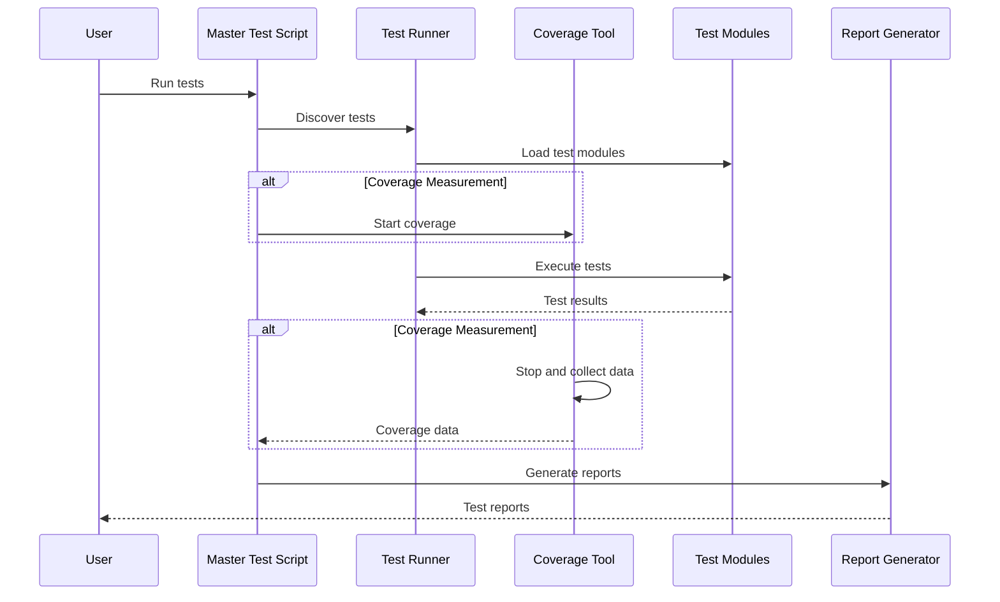
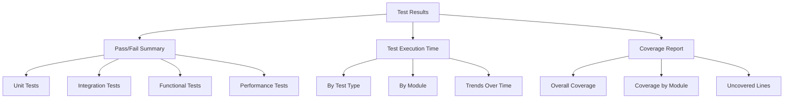

# DSGE Model Testing Framework

## Overview

This document outlines the comprehensive testing framework for the Smets and Wouters DSGE model implementation. The framework is designed to ensure code quality, correctness, and performance through multiple layers of testing.

## Testing Layers

### 1. Unit Tests

Unit tests focus on testing individual components in isolation, verifying that each class and function behaves as expected.

**Key aspects:**
- One test file per module
- Tests for normal operation and edge cases
- Mocked dependencies to isolate functionality
- High code coverage target (>80%)

**Example unit test structure:**
```
tests/unit/
├── core/                  # Tests for core module
│   ├── __init__.py
│   ├── test_base_model.py
│   └── test_steady_state.py
├── data/                  # Tests for data handling
├── solution/              # Tests for solution methods
├── estimation/            # Tests for estimation methods
└── ...
```

### 2. Integration Tests

Integration tests verify that different components work together correctly, focusing on the interactions between modules.

**Key aspects:**
- Test workflows and data flow between components
- Limited mocking, testing real component interactions
- Focus on key integration points

**Example integration test structure:**
```
tests/integration/
├── __init__.py
├── test_model_solution.py         # Model + Solution
├── test_data_estimation.py        # Data + Estimation
└── test_estimation_forecasting.py # Estimation + Forecasting
```

### 3. Functional Tests

Functional tests validate end-to-end workflows, ensuring that the system as a whole behaves correctly.

**Key aspects:**
- Test complete processes from input to output
- Minimal mocking, using real or realistic data
- Validate results against expected outcomes

**Example functional test structure:**
```
tests/functional/
├── __init__.py
├── test_estimation_workflow.py    # End-to-end estimation
├── test_forecasting_workflow.py   # End-to-end forecasting
└── test_scenario_analysis.py      # End-to-end scenario analysis
```

### 4. Performance Tests

Performance tests measure the efficiency and scalability of critical operations.

**Key aspects:**
- Benchmark execution time and memory usage
- Test scalability with different model sizes
- Track performance changes over time

**Example performance test structure:**
```
tests/performance/
├── __init__.py
├── test_solution_speed.py     # Solution method performance
├── test_memory_usage.py       # Memory consumption
└── test_scalability.py        # Scaling with model size
```

## Testing Utilities

### Mock Data Generator

A utility to generate realistic mock data for testing:

- Time series data with configurable properties
- Shock series with different persistence and volatility
- Steady state values for model testing
- Parameter sets for different model configurations

### Test Helpers

Helper functions to support testing:

- Temporary file and directory management
- Matrix and time series comparison functions
- Statistical test wrappers for model validation
- Test setup and teardown utilities

## Master Test Script

A central script (`master_test.py`) to manage test execution:

### Features:
1. **Test Discovery and Execution**
   - Automatic discovery of all test files
   - Configurable test selection (unit, integration, functional, performance)
   - Sequential or parallel execution

2. **Code Coverage Measurement**
   - Tracks which lines of code are executed during tests
   - Reports coverage percentage by module
   - Identifies uncovered code sections

3. **Test Reporting**
   - Summary statistics (pass/fail counts, execution time)
   - Detailed failure information with stack traces
   - Coverage metrics by module
   - Performance metrics and trend analysis

### Usage:
```bash
# Run all tests
python tests/master_test.py --all

# Run only unit tests
python tests/master_test.py --unit

# Run with coverage measurement
python tests/master_test.py --all --coverage

# Run tests and generate detailed report
python tests/master_test.py --all --coverage --report-dir=test_reports
```

## Test Execution Flow



## Test Results Visualization



## Testing Best Practices

### Test Isolation
- Tests should run independently with no shared state
- Each test should clean up after itself
- Tests should not depend on the order of execution

### Mock Data
- Use realistic mock data that captures real-world patterns
- Include edge cases and unusual conditions
- Separate test data from production data

### Test Documentation
- Clear docstrings explaining test purpose and approach
- Comments explaining complex test logic
- Examples of expected behavior

### Test Naming Conventions
- Consistent naming pattern: `test_<functionality>_<scenario>`
- Descriptive names that indicate what is being tested
- Group related tests in classes with descriptive names

## Debugging Scripts

Debugging scripts are specialized tools for troubleshooting specific issues:

- `debug_steady_state.py`: Debug issues in steady state calculations
- `test_import.py`: Verify correct module imports
- `test_core_import.py`: Test core module imports specifically
- `fix_corruption.py`: Fix corrupted Python files containing null bytes

These scripts are relocated to the `tests/debug/` directory to keep the root directory clean while preserving their functionality.

## Test-Driven Development Workflow

For new features or bug fixes:

1. Write a failing test that demonstrates the issue or required behavior
2. Implement the minimal code needed to pass the test
3. Refactor the code for clarity and performance
4. Verify all tests still pass

## Implementation Plan

### Phase 1: Directory Structure
- Create test directory hierarchy
- Set up test utilities and helpers
- Implement basic configuration

### Phase 2: Core Test Framework
- Implement master test script
- Create base test classes
- Set up mock data generators

### Phase 3: Unit Tests
- Create unit tests for core components
- Implement tests for data handling
- Add tests for solution methods

### Phase 4: Integration and Functional Tests
- Implement key integration tests
- Create end-to-end workflow tests
- Set up performance benchmarks

### Phase 5: Documentation and Refinement
- Complete test documentation
- Optimize test execution
- Set up CI integration

## Continuous Integration

The testing framework is designed to integrate with CI systems:

- Automated test execution on code changes
- Performance regression detection
- Test coverage requirements for pull requests
- Automatic test reporting

## Conclusion

This comprehensive testing framework ensures that the DSGE model implementation remains robust, correct, and efficient as development progresses. The multi-layered approach provides confidence in both individual components and the system as a whole.